# 📒 CollabNote Backend API

🚀 **CollabNote** is a collaborative note-taking backend service built with **Express.js**, **Prisma**, and **PostgreSQL**.  
It powers the frontend React app by providing a robust REST API for managing notes.

---

## 🚀 Tech Stack
| Layer    | Tech                        |
|----------|-----------------------------|
| Language | JavaScript (Node.js)        |
| Server   | Express.js                  |
| ORM      | Prisma                      |
| Database | PostgreSQL                  |
| Validation | express-validator         |
| Other    | dotenv, cors, nodemon       |

---

## 📦 Features
✅ Express REST API  
✅ PostgreSQL with Prisma ORM  
✅ CRUD operations on notes  
✅ Robust input validation  
✅ Consistent structured API responses  
✅ Error handling (400, 404, 422, 500)  
✅ CORS configured for React (localhost:5173)  
✅ Logger middleware for requests

---

## ✍️ API Endpoints

| Method | Endpoint                      | Description                              |
|--------|-------------------------------|------------------------------------------|
| GET    | `/api/notes`                  | Get all notes                            |
| GET    | `/api/notes/:id`              | Get a note by ID                         |
| GET    | `/api/notes?authorName=aaa`   | Get a note by author name                |
| POST   | `/api/notes`                  | Create a new note                        |
| PUT    | `/api/notes/:id`              | Update an existing note                  |
| DELETE | `/api/notes/:id`              | Delete a note                            |


## ⚙️ Validation & Error Handling

- **Create note (`POST /api/notes`):**
  - Requires `title`, `content`, `authorName` (all strings, length checks).
  - `isPublic` is optional (defaults to `true`).

- **Update note (`PUT /api/notes/:id`):**
  - At least one field required to update.

- **Error types handled:**
  - `400 Bad Request` for missing required data in raw checks.
  - `422 Unprocessable Content` for detailed validation errors.
  - `404 Not Found` for missing records.
  - `500 Internal Server Error` for server/DB issues.

✅ Consistent JSON format:
```json
{
  "status": "error",
  "message": "Description of the error",
  "details": null
}

or
```json
{
  "status": "Unprocessable Content",
  "errors": [
    {
      "type": "field",
      "msg": "Title must be provided",
      "path": "title",
      "location": "body"
    }
  ]
}

## 📝 Example Screenshots

### ✅ Successful responses

| Operation              | Screenshot                                                   |
|------------------------|--------------------------------------------------------------|
| Get all notes          | 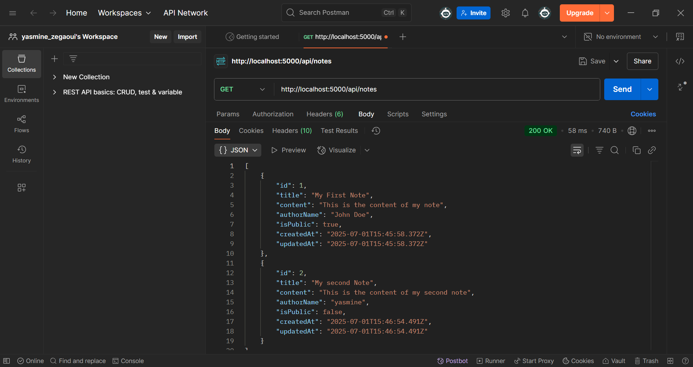         |
| Get single note by ID  | 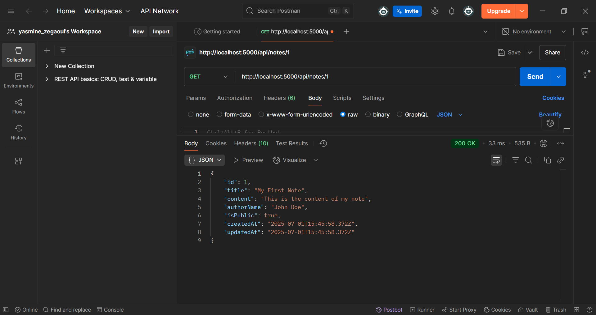        |
| Get notes by ID author | 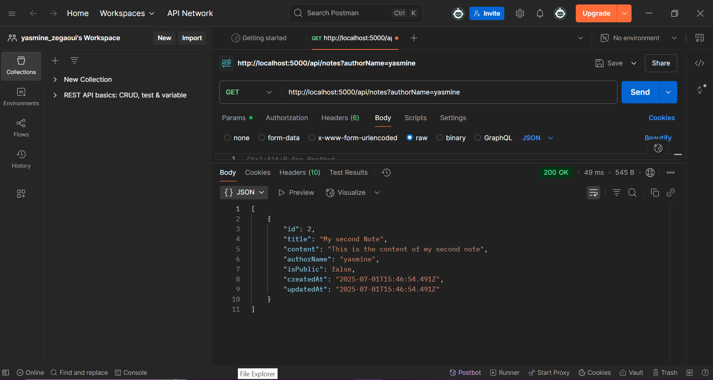|
| Create note            | 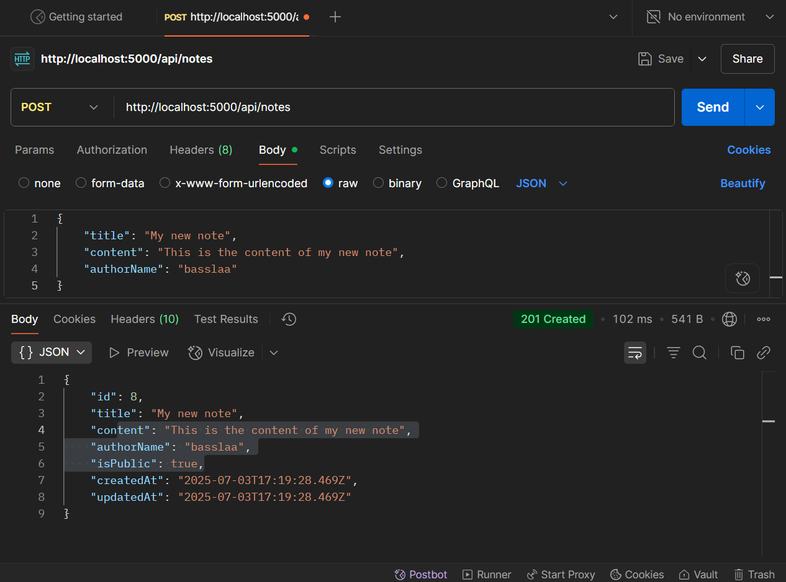         |
| Update note            | 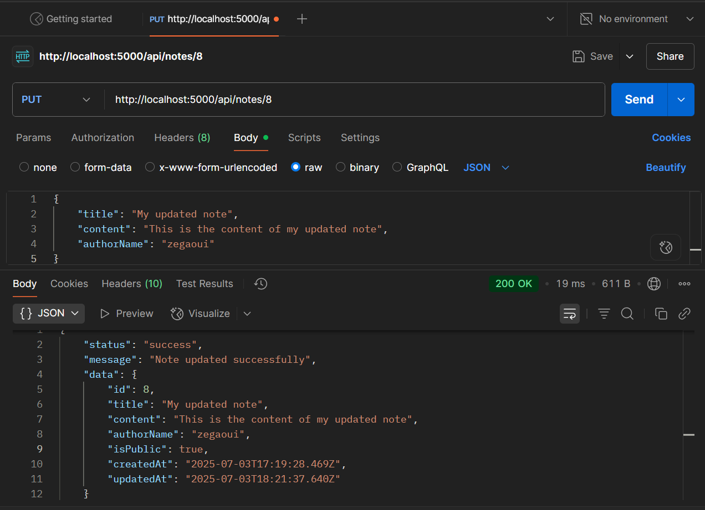            |
| Delete note            | 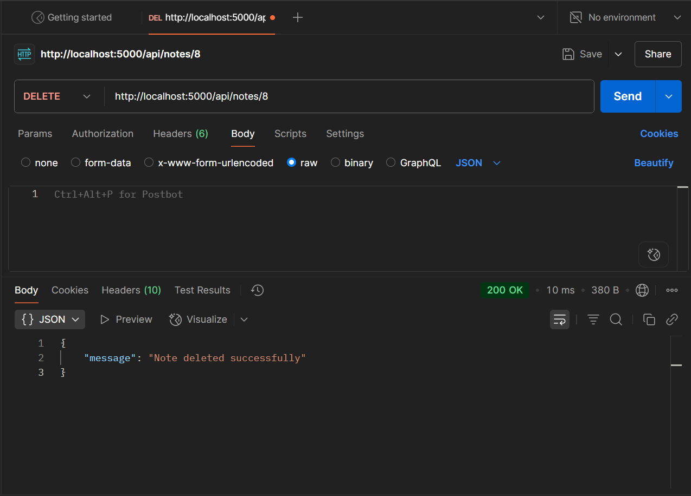            |

---

### ⚠️ Error responses

| Operation | Case                              |  Screenshot                                      |
|-----------|-----------------------------------|-------------------------------------------------|
| **GET**   | Note not found by ID              | 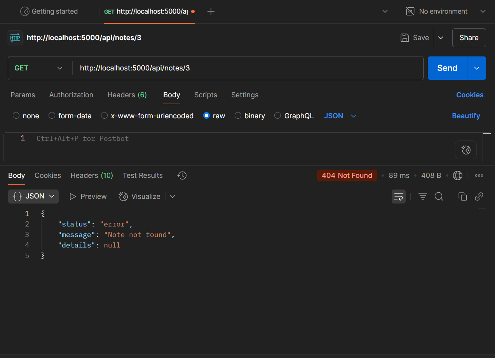 |
|           | No notes found by author          | 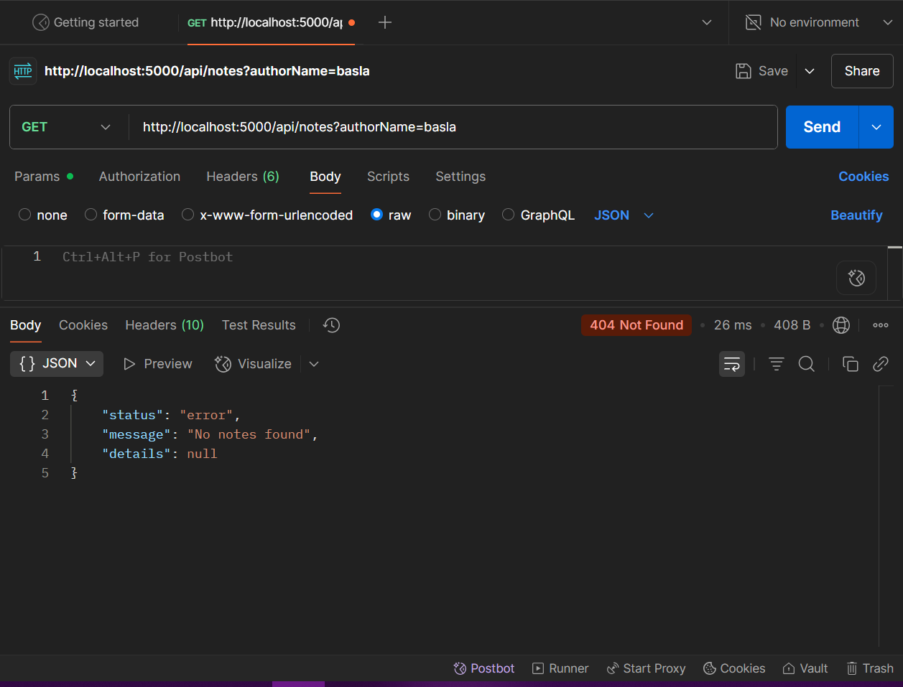 |
| **POST**  | Field must not be empty           | 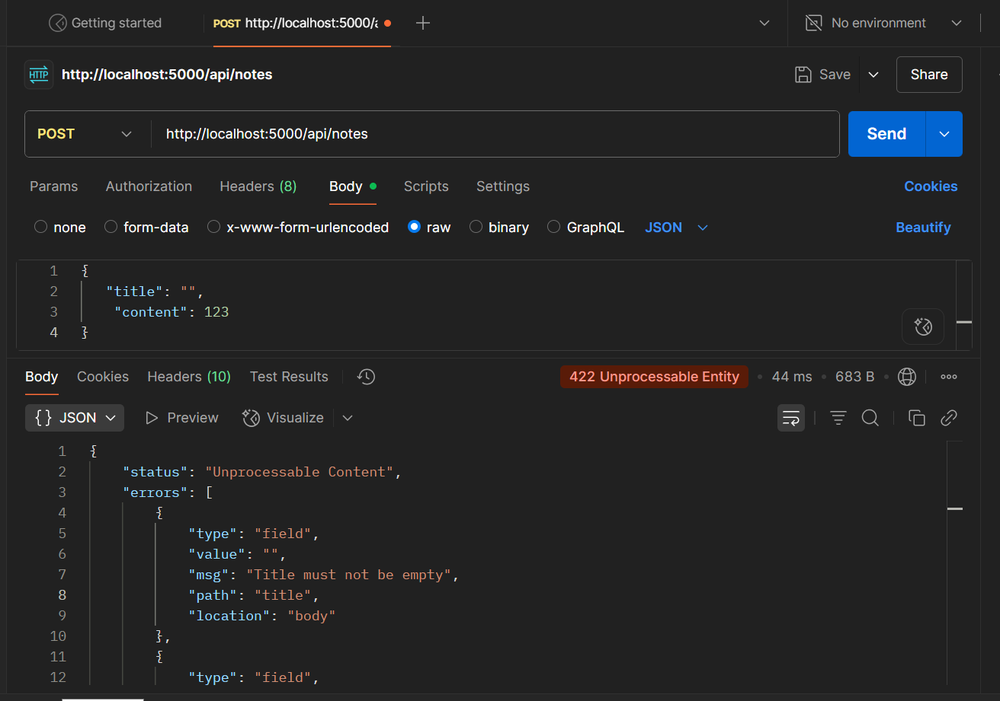 |
|           | Field is required                 | 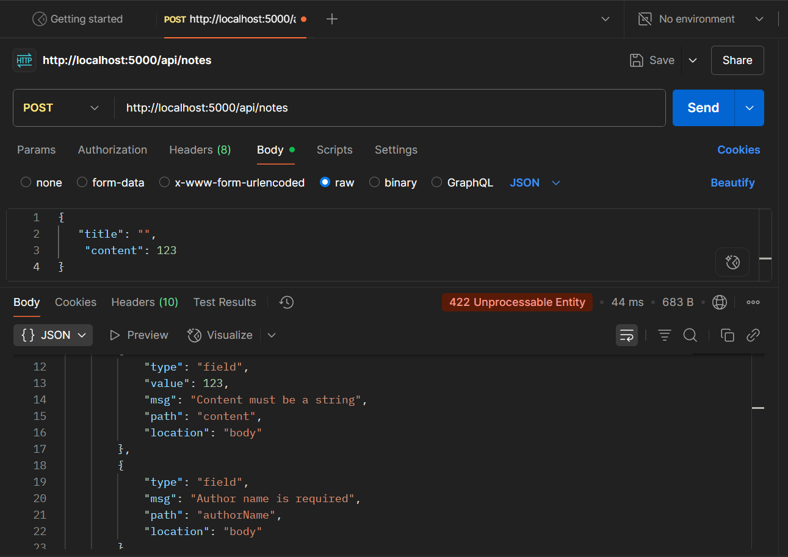 |
|           | Field must be a string            |  |
| **PUT**   | At least one field must be provided | 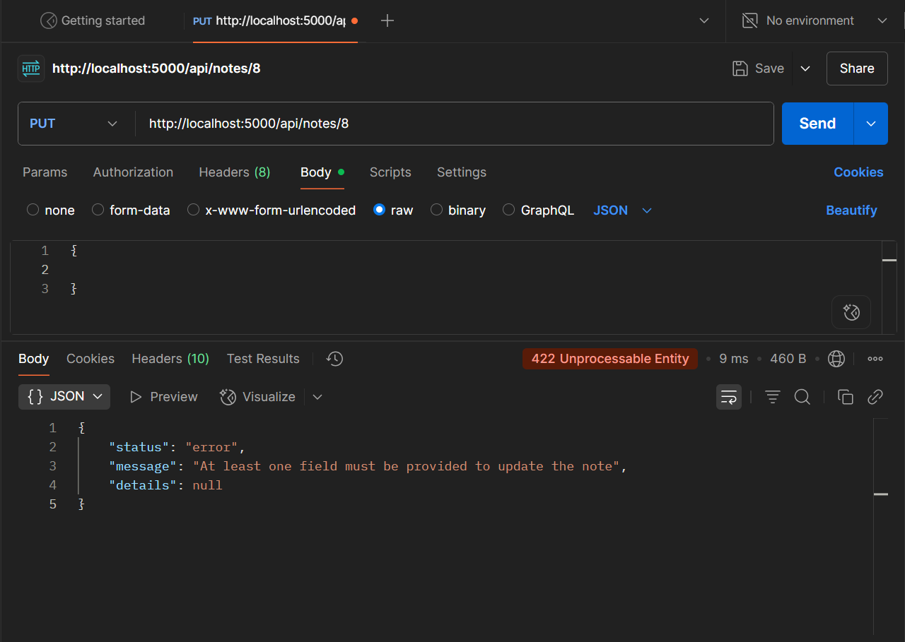 |
|           | Note not found                    | 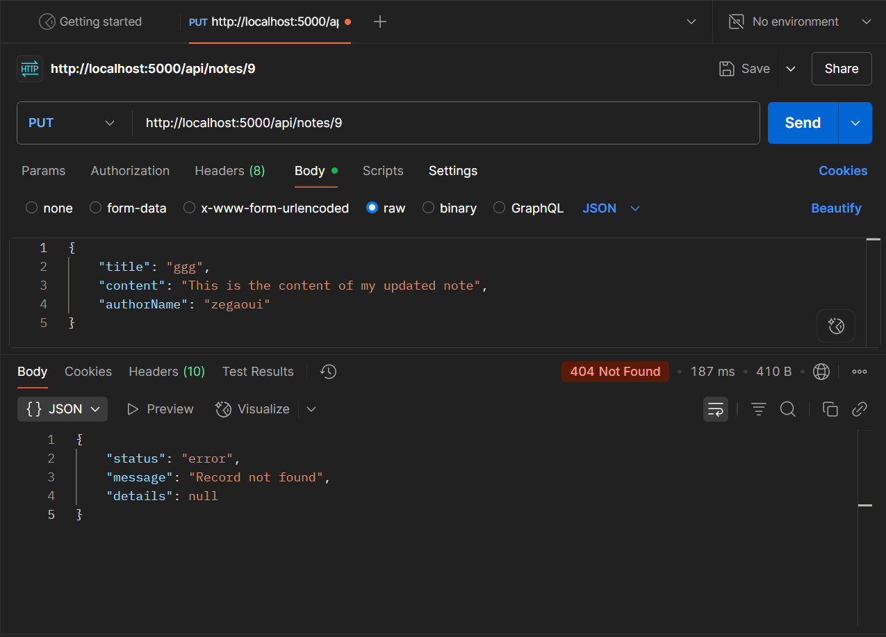 |
|           | Field must not be empty           | 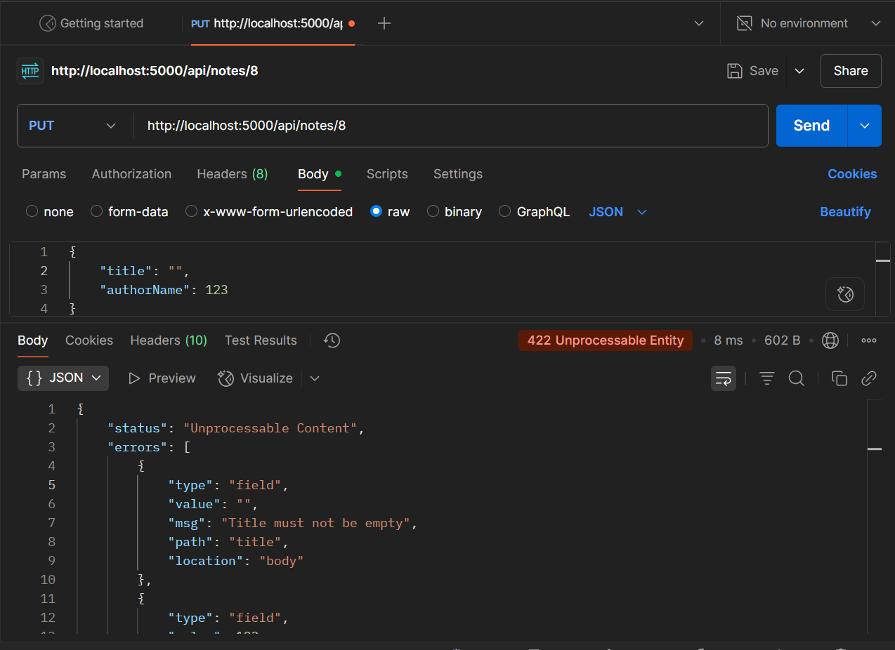 |
|           | Field must not be a string        | 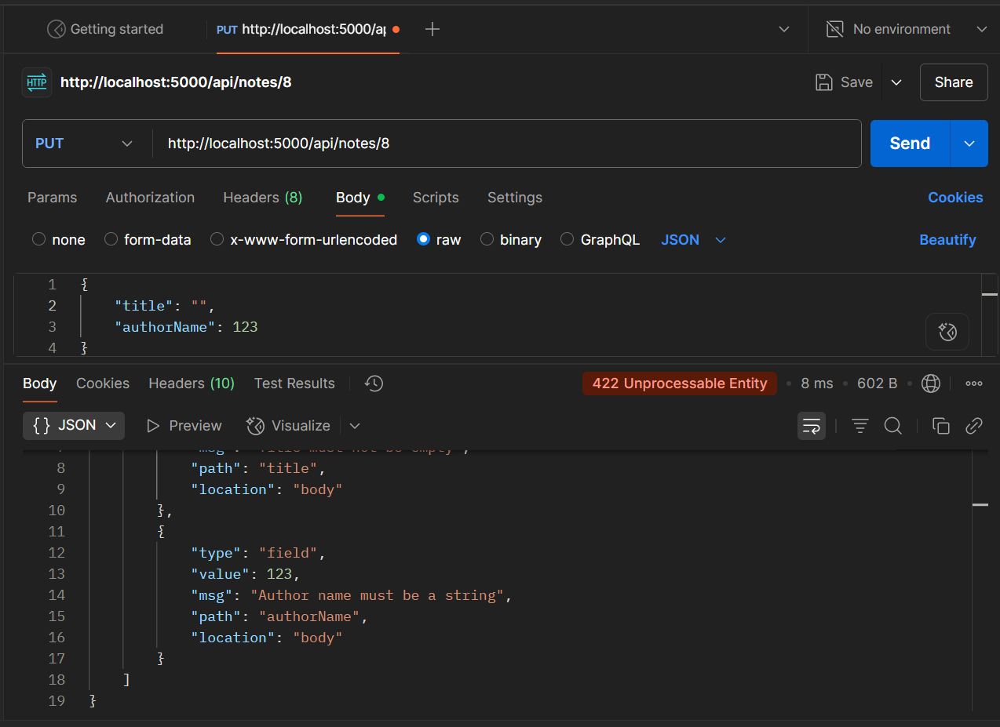 |
| **DELETE**| Note not found                    | 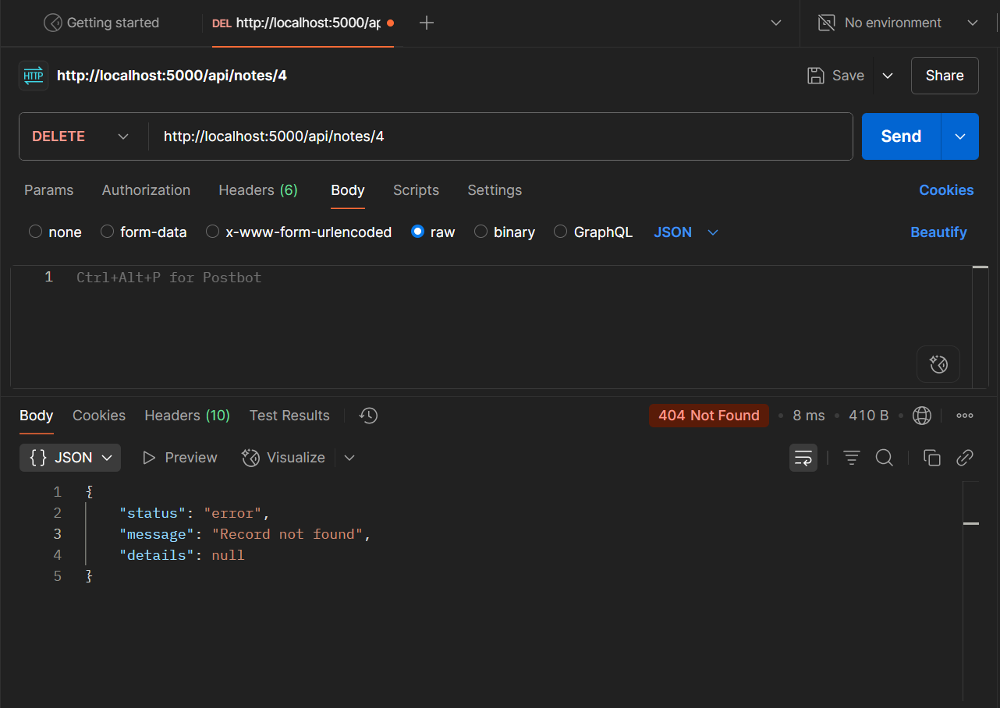 |

